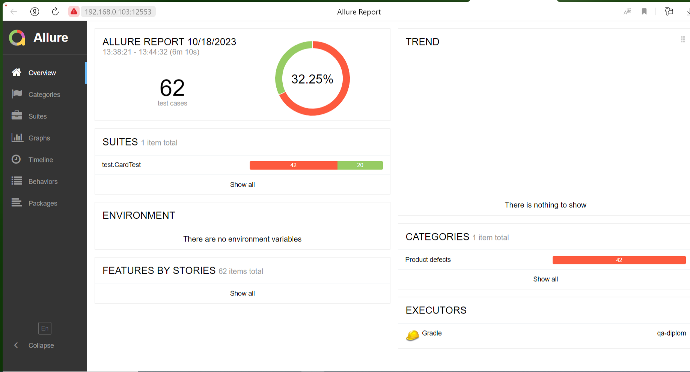

# Отчётные документы по итогам автоматизации

# Краткое описание
Выполнена автоматизация тестирования комплексного сервиса, взаимодействующего с СУБД и API Банка.

# Количество тест кейсов
Было выполнено 62 тест кейсов

# Процент успешных и не успешных тест-кейсов
* 20 тест-кейсов (32,25 %) были выполнены успешно
* 42 тест-кейсов (67,75 %) неуспешных

# Общие рекомендации

1. Устранить выявленные баги, указанные в issue
2. Предоставить документацию для более детального тестирования

# Отчет 

